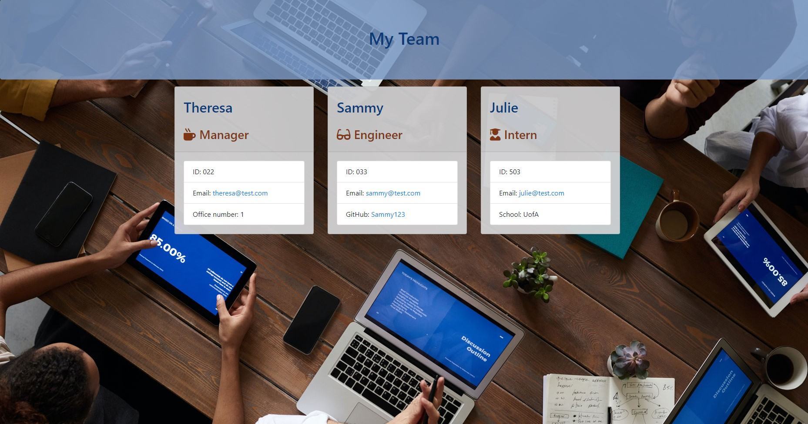

# Team Profile Generator

## Table of Contents
  * [Description](#description)
  * [Usage](#usefaq)
  * [Installation](#install)
  * [Testing](#test)
  * [License](#license)
  * [Demo Video](#demo)
  * [Contributing to This Repo](#contributefaq)
  * [Questions / Contact Details](#questions)

  
## Description
One of the most important aspects of programming is writing code that is readable, reliable, and maintainable. Oftentimes, *how* we design our code is just as important as the code itself. In this homework assignment, your challenge is to build a Node CLI that takes in information about employees and generates an HTML webpage that displays summaries for each person. Since testing is a key piece in making code maintainable, you will also be ensuring that all unit tests pass.

## Usage
I want to generate a webpage that displays my team's basic info so that I have quick access to emails and GitHub profiles

## Installation
npm i

## Testing
npm test

## License
The application is covered under a MIT license.

## Demo Video
A video demonstration of this application can be found [here](https://youtu.be/XwDZOvQD080).
Click the image to launch the video.

## Contributing to This Repo
Please Contact me.

## Questions / Contact Details
This app can be found on my Github page at [TreeGee73](https://github.com/TreeGee73).

If you have any questions or need to contact me about this app, I can reached either on Github or by email at [treegee73@gmail.com](treegee73@gmail.com).
